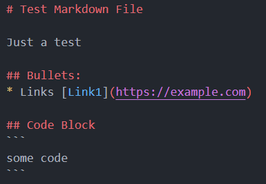
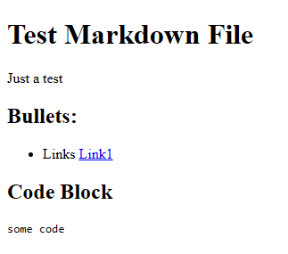

# Markdown File Previewer CLI App

A simple CLI App that can be used to parse a single Markdown file (.md) into HTML and then displays it on the browser.
Input can be passed using file (.md) and also using STDIN.

## How to Install
### Clone the repository

    git clone https://github.com/dummyheaad/go-cli-md-previewer.git

### Build the executable

    git build .

## Functionalities
### Preview a markdown file

    ./mdp -file FILENAME

### Preview a markdown file using custom HTML template

    ./mdp -file FILENAME -t TEMPLATE

### Generate HTML from markdown file

    ./mdp -file FILENAME -s

### Generate HTML using custom template

    ./mdp -file FILENAME -s -t TEMPLATE

### Generate HTML from STDIN

    cat << EOF | ./mdp -s
    # Test 1
    ## Test 2
    EOF

### Generate HTML from STDIN using custom HTML template

    cat << EOF | ./mdp -s -t
    # Test 1
    ## Test 2
    EOF

## Example
Given this test.md file:

Let's generate an HTML for test.md

    ./mdp -file FILENAME -s

Output:

